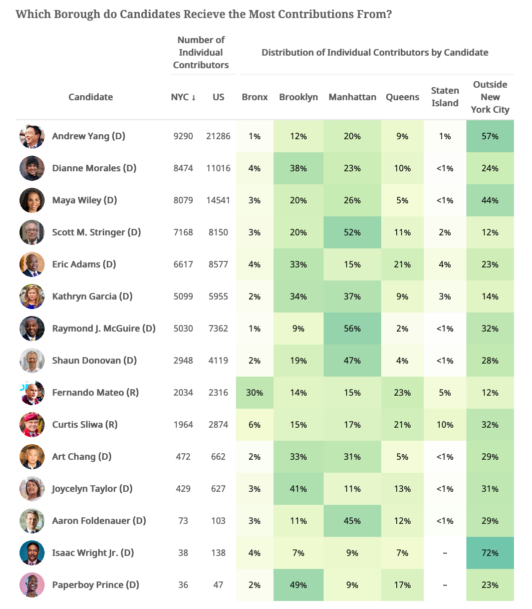

# nyc-mayorial-election-data
Project Summary
------
Data plays a key role in just about every political campaign. Historically, polls have gathered data to help answer questions like what issues matter the most to voters and who is the most likely candidate to win an election. While no poll produces perfect results, data from good polls can be valuable temperature checks for both candidates and voters. Beyond polling, political campaigns use many other sources of data, such as campaign finance statistics, to track the number and average amount of contributions. I explore both polling and campaign finance data for the 2021 New York City mayoral election to gain a deeper insight into which candidates are polling high before the Democratic primary and understand who is donating to the candidates.

<!-- -->

Repo Guide
------
+ /code : code used for the analysis
+ /data : data from the [New York City Campaign Finance Board](https://www.nyccfb.info/follow-the-money) as of May 31, 2021
+ /data : polling data as of May 31, 2021
+ /graphics : graphics made from the data
